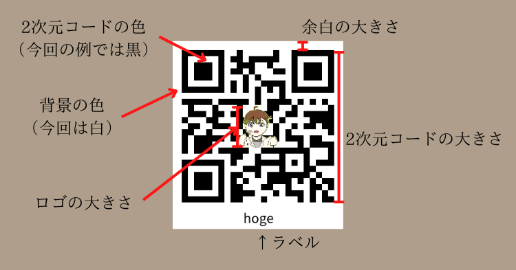
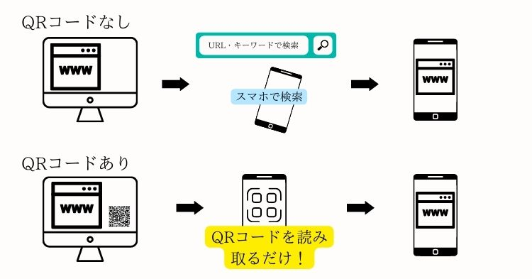

# 2次元コード（QRコード）自動生成プラグイン

サイト運営者がQRコードを導入するメリットは、**ユーザーがモバイル端末からアクセスしやすいサイトを作れる**という点にあります。  
QRコードが設置されているサイトは、ユーザーがスマホから簡単にアクセスできるサイトになります。

今回、WordPressサイトに全自動で簡単にQRコードを設置できるプラグイン【auto QR Generator】を開発しました。

気になるお値段ですが、~~定価790円~~のところ、初回セールで490円で販売します。

まずは、無料版からお試しください。  
プラグインダウンロードはこちらから↓  

[無料版ダウンロード](plugin/auto-QR-generator-Lite.zip)

## プラグインについて

### プラグインでできること

プラグイン【auto QR Generator】では、

* ページごとに対応したQRコードの自動生成
* QRコードの設置場所を選択可能[^1]
* QRコードの高カスタマイズ性

[^1]: 無料版では、トップページ、固定ページ、カテゴリートップページにのみ設定することが可能です。個別の記事ページに設置するためには、有料版をご購入ください。

を行うことができます。

WordPressサイトでは、プラグインを導入するだけで、誰でも簡単に指定ページにQRコードを導入することができます[^1]。

プラグインにより、QRコードは各ページごと[^2]に自動生成されるため、サイトのページが増えても新たにQRコードの準備をする必要がありません。

[^2]: プラグインで生成されるQRコードは、サイトのページURLが https://hogehoge.com/ だった場合、そのページに遷移するQRコードとなります。

また、QRコードのカスタマイズも自由に行うことができます。

QRコードのカスタマイズ項目は、下の画像を参照してください。

上の画像の通り、QRコードの大きさに加え、QRコードの色を変更することも可能です。

また、QRコードの中心にロゴを設定したり、下部にラベルを表示したりすることも可能です。

### 価格は490円と非常にお得

当プラグインの価格は490円。定価は790円ですが、**初回セールで期間限定で490円**となっています。[^3]

[^3]: セール期間は未定となっているため、予告なく価格が変更になる場合があります。

また、プラグインは買い切りなので、一度購入していただければ今後永続的にご利用いただけます。

今後、WordPressのバージョンに合わせて定期的にアップデートを行なっていく予定なので、手厚いサポート面が受けられるプラグインです。

各ページに個別のQRコードを設置する手間を考えれば、非常にお買い得であると言えるのではないでしょうか。

## QRコード設置の重要性とメリット

QRコードの重要性は、

1. Googleが暗に推奨している
2. ユーザーが使いやすいサイトを作れる

という2つに大別されます。それぞれ詳しくみていきましょう。

### QRコードはGoogleが暗に推奨するSEO対策である

「[Googleが掲げる10の事実](https://about.google/philosophy/?hl=ja)(外部サイトへ遷移します)」というものをご存じでしょうか？  
Googleが会社設立当初から掲げる、サイト運営者へのメッセージです。

これらの中から、QRコードに関連する項目から一部を抜粋して紹介します[^4]。

[^4]: [Googleが掲げる10の事実](https://about.google/philosophy/?hl=ja)より引用

> 1.　ユーザーに焦点を絞れば、他のものはみな後からついてくる。Google は、当初からユーザーの利便性を第一に考えています。（略）
>
> 5.　情報を探したくなるのはパソコンの前にいるときだけではない。世界はますますモバイル化し、いつどこにいても必要な情報にアクセスできることが求められています。（中略）スマートフォンから Google 検索にさまざまな方法でアクセスできるだけでなく、（中略）世界中のあちこちからスマートフォンをさまざまな用途に使えるようになりました。

つまり、「モバイル端末でもアクセスしやすい、ユーザーファーストのサイトを作るべきである」ということです。  
QRコードの設置は、Googleが求めるサイトを作るためには欠かせない要素です。そのため、Googleからの評価が上がる可能性が期待できる立派なSEO対策ということができるのです。

### スマホからのアクセスが容易になる

ユーザーにとって、**スマホからのアクセスがしやすいサイト＝便利なサイト**となります。  
ユーザーからの評価が上がることは、Googleからの評価が上がることを意味します。

QRコードの有無は、ユーザーにとっては大きな意味を持ちます。  
ユーザーの利便性を考えたとき、自身のサイトにQRコードを設置したいと考えるサイト運営者は多くいることでしょう。

この図で見ても分かる通り、QRコードは便利なサイトを作るうえで不可欠な要素なのです。

## WordPressでは実現不可能！？

これまで見てきたように、QRコードの設置は、ユーザーにとって便利なサイトを作るうえで不可欠な要素です。  
また、SEO効果も期待できるため、QRコードはサイト運営者とユーザーのどちらにとっても嬉しいものなのです。

しかし、WordPressサイトでQRコードをページごとに設置するには、非常に手間がかかります。  
実際に、ページごとに**異なる**QRコード設置するためには、2つの方法しかありません。

1. ページごとにQRコードを設置する
1. プラグインを導入する

サイトのページ数が少ない場合には、1の方法でも対応できるかもしれません。  
しかし、サイトのページ数が多くなり、本格的にSEO対策を考えているサイト運営者の方にとっては、かなりの手間がかかってしまいます。

そこで、今回は、全ページに自動的にQRコードを設置するプラグイン**auto QR Generator**を開発しました。  
このプラグインを導入するだけで、簡単にQRコードの設置を行うことができるようになります。

## プラグインのダウンロードと使い方

プラグインのダウンロード方法と使い方については、こちらのページよりご確認ください。  
[プラグインのダウンロード方法と使い方に関して](../plugin_setting/)