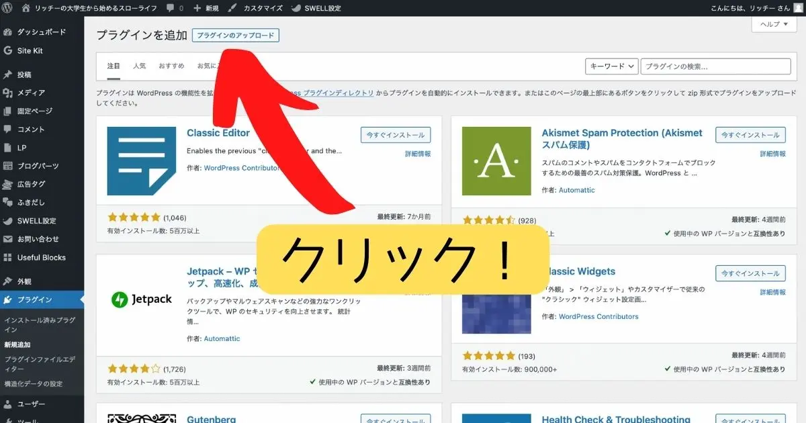
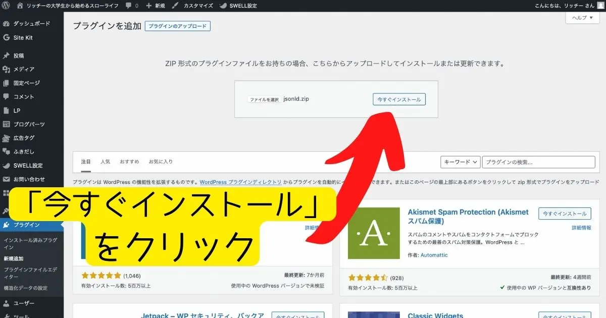
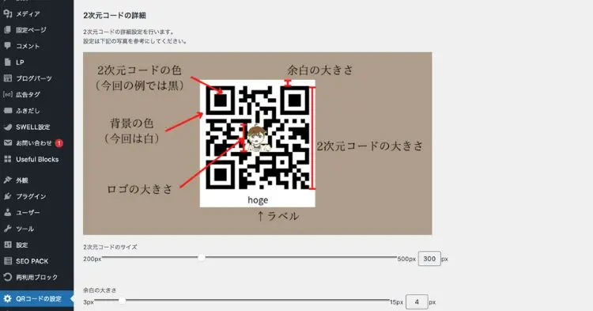
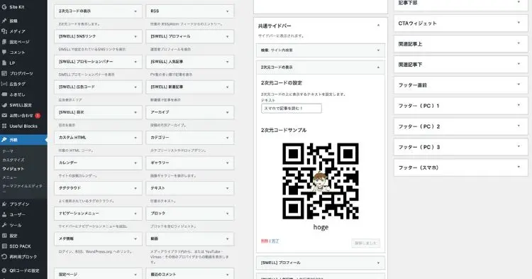

# プラグインのダウンロード方法と使い方

プラグインのダウンロードはこちらのページから行うことができます。

今回は無料版についてのダウンロード方法を紹介しますが、有料版も同様にダウンロードすることができます。

## プラグインを有効にする方法

### プラグインのzipファイルをダウンロードする

まずは、こちらのzipファイルをダウンロードします。  
ダウンロード後にzipファイルを解凍する必要はありません。

[プラグインzipファイル（無料版）](./plugin/auto-QR-generator-Lite.zip)

### プラグインをWordPressにアップロードする

インストールしたzipファイルを、WordPressにアップロードします。

プラグインをインストールした後、通常通りプラグインの有効化を行います。

## プラグインの設定を行う

プラグインを有効にした後、プラグインを使うには初期設定を行う必要があります。

まずは、QRコードの初期設定を行います。  
プラグインの有効後、管理画面に「QRコードの設定」という項目が表示されます。  

QRコードの設定を行えるのは、下記の項目です。

* QRコードの大きさ
* 余白のサイズ
* QRコードの色
* 背景の色
* 中心に設置するロゴ画像（任意）とその大きさ
* QRコードの下に表示するラベル（任意）とその色

QRコードは、小さすぎると読み込めないため、最低でも300pxほどの大きさにする必要があります。  
また、QRコードの色と背景の色のコントラストを付けないと、QRコードの読み取りができない場合があります。

このページで設定したQRコードのサンプルは、設定画面の下記に表示されます。  
スマホなどで読み取った際 `This QR code is perfect!` と表示されれば設定は完了です。

## QRコードの設置場所を選択する

QRコードの設定が終わったら、QRコードを設置する場所を選択します。  
WordPressの管理画面から「外観」→「ウィジェット」よりQRコードの設置場所を選択します。

ウィジェットの項目名は、「2次元コードの表示」となっています。

QRコードの上に表示するテキスト（任意）を入力後、保存ボタンを押して設定を完了させます。  
設定完了後、ご自身のサイトに反映されているのかを確認してください。

以上にてプラグインの設定は完了です。